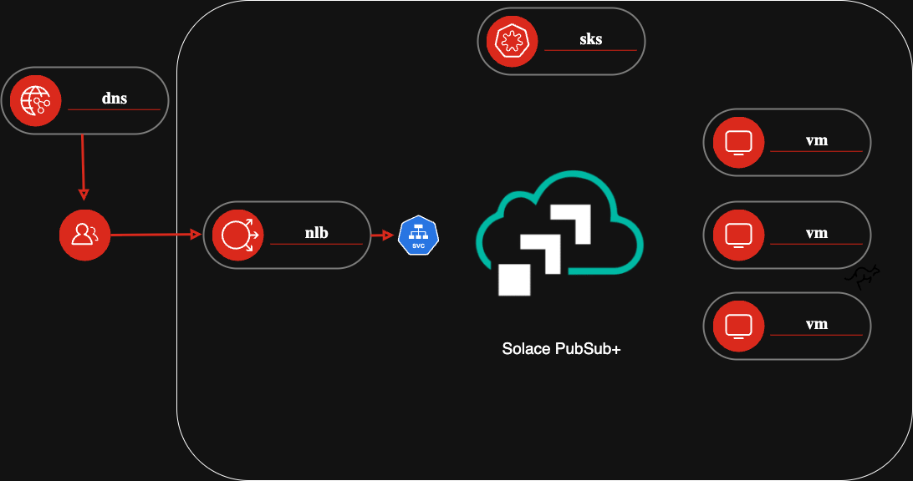

# solace-ha
Solace HA deployment on Exoscale using Terraform

This is a deployment created for the Thinkport Webinar and should not be used in production without adjustments. This deployment does have security issues as it creates and stores a Kubernetes Admin credential file in the Terraform state and dependencies between Terraform and Kubernetes for the NLB that require manual intervention. If used for production strongly consider removing the kubeconfig part and deploy the Solace manifest in "solace-k8s" through proper means.

## solace-infrastructure
A SKS managed Kubernetes cluster is deployed with required Securit Group and nodepool as K8s worker nodes. Once the cluster is operational a kubeconfig file is created and stored to local disk.

The Solace Kubernetes Operator is deployed to the cluster using the kubeconfig file to authenticate. The deployment is monitored to execute the next step when Kubernetes reports the deploment to be operational.

Once the Operator is up we apply the ha-exoscale.yaml to deploy Solace PubSubPlus with adjustments to fit Exoscale. This includes using the Exoscale CCM (Cloud Control Manager) to create a Network Load Balancer (NLB) with a public IP to expose Solace to the Internet.

A DNS A entry is set to the NLB IP to allow easy access to the new Solace deployment.

### Files to modify
#### locals.tf
zone - Adjust with the Zone of Exoscale to be used
project - This string is used as name for the infrastructure as well as the A entry in DNS zone "cldsvc.io"

#### variables.tf
Adjust API key for infrastructure calls and DNS calls. Can be the same key.

#### dns.tf
domain - change to UUID of the top level domain registered with Exoscale DNS.

## solace-event-mesh
Based on the Solace HA deployment, an Event Mesh between a local and remote Solace HA Broker is established.

The local broker is initiating the Dynmic Message Routing (DMR) Bridge towards the remote broker, setting up a bidirectional bridge.

The DMR bridge allows for dynamic and transparent distribution of data between different environments.

The following TF variables need to be set for the local and remote broker.

One use case for this unique functionality is a seamless cloud migration to a European cloud provider for example.

### TF Variables for local broker

### TF Variables for remote broker
